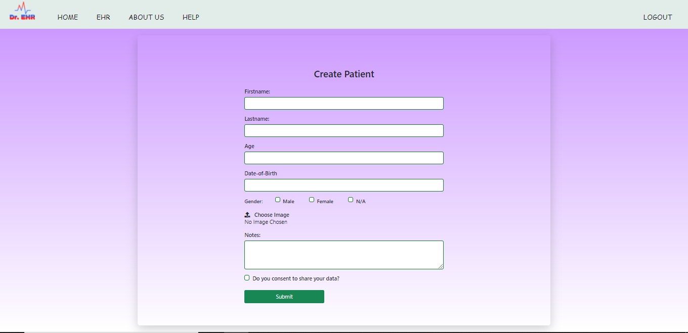

<h1>EHR CRUD system </h1>

 A basic EHR CRUD system where the doctors are able to create, access, update and delete their patient records.

 

<h2>Loginpage EHR</h2>

<h2>Homepage EHR</h2>

<h2>Patient record</h2>

<h2>Create patient form</h2>

